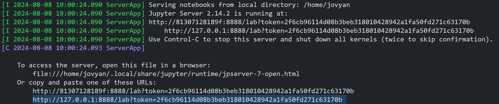
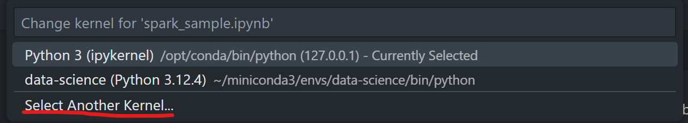

## OLD

[Apache spark official](https://hub.docker.com/r/apache/spark/)
docker run -it apache/spark-py /opt/spark/bin/pyspark

[Docker official image](https://hub.docker.com/_/spark)
docker run -it spark /opt/spark/bin/spark-shell

docker run -it --rm -p 8888:8888 -v "${PWD}":/home/jovyan/work quay.io/jupyter/all-spark-notebook

## Configuration
Caricare il container docker

[Jupyter official image](https://hub.docker.com/r/jupyter/pyspark-notebook)
```bash
    docker run -p 8888:8888 quay.io/jupyter/pyspark-notebook
```

Copiare l'URL del server jupyter per poter utilizzare il notebook 


Procedura su VS code



